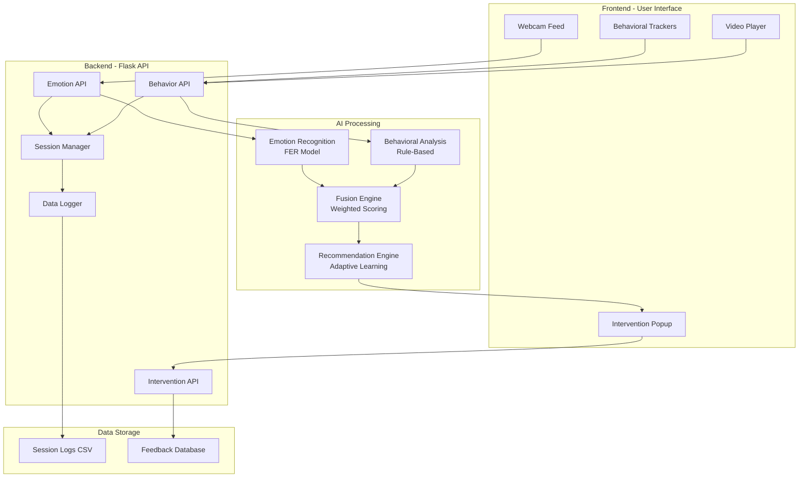

# System Architecture Documentation

## Overview

The AI-Based Silent Confusion Detection System uses a modular, three-tier architecture:

1. **Frontend Layer** - User interface and data collection
2. **Backend Layer** - API services and business logic
3. **AI Processing Layer** - Machine learning models and algorithms

## Component Diagram



## Data Flow

### 1. Emotion Detection Flow

```
Webcam → Capture Frame (3s interval) → Base64 Encode → 
POST /api/emotion/detect → FER Model → Emotion Probabilities → 
Confusion Score → Return to Frontend
```

### 2. Behavioral Analysis Flow

```
User Actions (Mouse/Keyboard/Video) → Track Events → 
Aggregate Data (5s window) → POST /api/behavior/track → 
Behavioral Model → Calculate Scores → Return to Frontend
```

### 3. Intervention Decision Flow

```
Emotion Score + Behavior Score + Video Score → 
POST /api/intervention/check → Fusion Engine → 
Weighted Combination → Temporal Smoothing → 
Threshold Check → Recommendation Engine → 
Intervention Content → Display Popup
```

### 4. Feedback Loop

```
User Feedback (Helpful/Dismiss) → 
POST /api/intervention/feedback → 
Update Feedback Stats → Adaptive Learning → 
Improve Future Recommendations
```

## Module Specifications

### Emotion Recognition Module

**Technology**: FER (Facial Emotion Recognition) library  
**Input**: Base64 encoded webcam frame  
**Output**: Emotion probabilities + confusion score  
**Processing Time**: ~200-500ms per frame  
**Accuracy**: Depends on lighting and face visibility

**Emotions Detected**:
- Angry, Disgust, Fear, Happy, Sad, Surprise, Neutral

**Confusion Mapping**:
- High confusion: Sad (0.5), Fear (0.4), Angry (0.3)
- Low confusion: Happy (-0.2), Neutral (0.0)

### Behavioral Analysis Module

**Technology**: Rule-based algorithms  
**Input**: Mouse, keyboard, and video interaction data  
**Output**: Behavioral confusion score (0-1)

**Mouse Analysis**:
- Inactivity duration (threshold: 30s)
- Hesitation patterns (back-and-forth movements)
- Movement frequency

**Keyboard Analysis**:
- Typing pauses (threshold: 15s)
- Typing speed (threshold: 20 cpm)
- Deletion frequency (uncertainty indicator)

**Video Analysis**:
- Pause frequency (threshold: 5 per 5 min)
- Rewind count (threshold: 3 per 5 min)
- Segment replay (threshold: 2 replays)

### Fusion Engine

**Technology**: Weighted scoring + temporal smoothing  
**Input**: Emotion, behavior, and video scores  
**Output**: Unified confusion score + intervention decision

**Algorithm**:
```python
raw_score = 0.4 * emotion + 0.3 * behavior + 0.3 * video
smoothed_score = moving_average(raw_score, window=5)
intervention_needed = smoothed_score >= 0.6
```

**Explainability**:
- Identifies primary confusion factor
- Lists contributing factors
- Provides confidence score

### Recommendation Engine

**Technology**: Rule-based + adaptive learning  
**Input**: Confusion data with explanation  
**Output**: Intervention type + content

**Rules**:
- Emotion-based → Simpler Explanation
- Behavior-based → Real-Life Example
- Video-based → Concept Recap
- Mixed → Short Quiz

**Adaptive Learning**:
- Tracks feedback for each intervention type
- Calculates success rates
- Adjusts recommendations based on effectiveness

## API Endpoints

### Emotion Detection

**POST** `/api/emotion/detect`

Request:
```json
{
  "image": "data:image/jpeg;base64,..."
}
```

Response:
```json
{
  "success": true,
  "emotions": {
    "angry": 0.1,
    "sad": 0.3,
    ...
  },
  "confusion_score": 0.45,
  "face_detected": true
}
```

### Behavioral Tracking

**POST** `/api/behavior/track`

Request:
```json
{
  "mouse_data": {
    "inactivity_duration": 25,
    "movement_count": 3,
    "hesitation_count": 2
  },
  "keyboard_data": {
    "pause_duration": 18,
    "typing_speed": 15,
    "deletion_count": 7
  },
  "video_data": {
    "pause_count": 4,
    "rewind_count": 2,
    "replay_count": 1
  }
}
```

Response:
```json
{
  "success": true,
  "mouse_score": 0.45,
  "keyboard_score": 0.62,
  "video_score": 0.58,
  "overall_behavior_score": 0.55
}
```

### Intervention Check

**POST** `/api/intervention/check`

Request:
```json
{
  "emotion_score": 0.65,
  "behavior_score": 0.55,
  "video_score": 0.48
}
```

Response:
```json
{
  "success": true,
  "intervention_needed": true,
  "recommendation": {
    "show_intervention": true,
    "intervention_type": "simpler_explanation",
    "content": {
      "title": "Need a Simpler Explanation?",
      "message": "...",
      "action": "Show Simpler Explanation"
    }
  },
  "confusion_data": {
    "smoothed_score": 0.62,
    "explanation": {
      "primary_factor": "emotion",
      "primary_explanation": "..."
    }
  }
}
```

### Feedback Submission

**POST** `/api/intervention/feedback`

Request:
```json
{
  "intervention_type": "simpler_explanation",
  "was_helpful": true
}
```

Response:
```json
{
  "success": true,
  "message": "Feedback recorded successfully"
}
```

## Performance Considerations

### Frontend
- Webcam capture: Every 3 seconds
- Behavioral tracking: Every 5 seconds
- Minimal CPU usage with efficient event handlers

### Backend
- Emotion detection: ~200-500ms per request
- Behavioral analysis: <50ms per request
- Fusion engine: <10ms per request

### Scalability
- Current design: Single-user, local deployment
- For multi-user: Add authentication, database, load balancing
- For production: Use Redis for session management, PostgreSQL for logs

## Security Considerations

### Current Implementation (Development)
- No authentication (local use only)
- CORS enabled for all origins
- Webcam data processed locally

### Production Recommendations
- Add user authentication (JWT tokens)
- Implement HTTPS
- Restrict CORS to specific domains
- Encrypt sensitive data
- Add rate limiting
- Implement privacy controls (data retention policies)

## Testing Strategy

### Unit Tests
- Test individual modules in isolation
- Mock external dependencies
- Verify edge cases and error handling

### Integration Tests
- Test API endpoints with real requests
- Verify data flow between components
- Test error propagation

### Manual Testing
- Live demo with sample video
- Simulate confusion signals
- Verify intervention triggering
- Check data logging accuracy

## Deployment

### Development
```bash
# Backend
cd backend
python app.py

# Frontend
Open frontend/index.html in browser
```

### Production (Future)
- Containerize with Docker
- Deploy backend on cloud (AWS/GCP/Azure)
- Serve frontend via CDN
- Use managed database services
- Implement CI/CD pipeline
